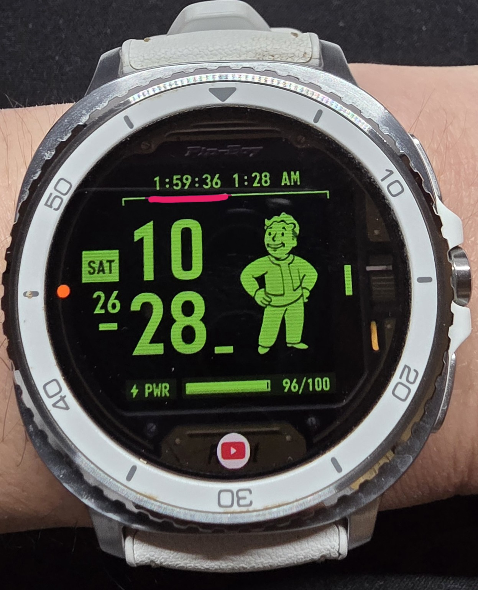

# Watch Timer Bridge

**Watch Timer Bridge enables compatible third-party Wear OS watch faces to display the live Samsung Timer countdown in a dedicated complication slot.** It is a bridge for Samsung Timer, not another timer app.

## Overview

Samsung Timer already integrates with Galaxy Watch software. On supported watches, its running countdown can appear in Samsung's Now Bar. The Now Bar is a shared surface for ongoing activities, however, so another activity such as media playback or exercise may take priority and displace the timer from view.

Third-party watch faces generally cannot use Samsung Timer's live numeric countdown as a freely selectable, dedicated standard complication. Watch Timer Bridge reads timing data from Samsung Timer's active notification `Chronometer`, reconstructs the countdown, and publishes it as a Wear OS `SHORT_TEXT` complication data source. Samsung Timer remains the timer and the source of truth.

**Samsung Timer → notification Chronometer → Watch Timer Bridge → Wear OS `SHORT_TEXT` complication → third-party watch face**

## Example: Facer Pip-Boy SE



*Tested example: Samsung Timer countdown (1:59:36, top left) displayed on the Facer Pip-Boy SE watch face through Watch Timer Bridge.*

## Why this exists

The Now Bar is useful for ongoing activities, but it is not a permanently dedicated timer location. If another supported activity takes priority, the timer may no longer be visible at a glance. A complication lets the user choose a particular place on the watch face for the countdown.

| Path | Where the countdown appears |
| --- | --- |
| Samsung Timer → Now Bar | A shared activity area; another activity may displace the timer. |
| Samsung Timer → Watch Timer Bridge → complication | A dedicated, user-selected slot on a compatible third-party watch face. |

Samsung also has native watch-face integration on some faces. This project addresses the gap for third-party faces that accept a standard `SHORT_TEXT` complication but cannot freely select Samsung Timer's live numeric countdown as one.

## How it works

1. The notification listener detects an active notification from Samsung Timer (`com.samsung.android.watch.timer`).
2. The bridge reads the `Chronometer` in the notification's `customDisplayBundle/cardChronometerRemoteView` and derives the timer deadline.
3. It publishes the remaining time through a Wear OS `SHORT_TEXT` complication provider.
4. A compatible watch face renders that provider in its selected complication slot. Tapping the complication tries to open Samsung Timer.

This uses Samsung Timer's notification structure, **not an official Samsung Timer complication API**. The bridge does not start, control, replace, or change the actual timer or alarm.

## Results and compatibility

The primary result is a live numeric Samsung Timer countdown in a normal third-party watch-face complication slot. The photographed setup uses a **Samsung Galaxy Watch 8 Classic**, **Samsung Timer**, **Facer**, and the **Facer Pip-Boy SE** face with a `SHORT_TEXT` slot.

Watch Timer Bridge may work with other third-party Wear OS watch faces that support compatible `SHORT_TEXT` slots, but broader compatibility has not yet been verified. Some watch faces restrict which complication providers can be selected. Reports of working watch and face combinations are welcome.

Secondary implementation refinements in v1.0.6 include:

- A prompt complication update after Samsung Timer starts or stops.
- Full `H:MM:SS` while an hour or more remains and the screen is interactive, where the face has enough space. Below an hour, the system's self-updating `MM:SS` text is used.
- A default empirical −1-second display adjustment for closer visual agreement with Samsung Timer. The actual Samsung Timer deadline and alarm are not changed.
- A stopwatch glyph (`⏱︎`) in the idle state when no timer is running.
- Reduced app updates: repeated equivalent notification events are ignored, and per-second app updates for long timers stop while the screen is off.

## Limitations and discussion

- Samsung may change the notification layout or behavior in a future Timer update, which could require changes to this bridge. Other timer apps are unsupported.
- Testing so far covers a limited combination of hardware, Samsung Timer software, and watch face. Other models and faces need testing; faces can impose width or font constraints on long countdowns.
- The Now Bar remains Samsung's native ongoing-activity display. This app does not modify or disable it; it adds a route to a dedicated complication.
- On some Watch Face Format faces, a conditional graphic used in place of idle complication text can remain visible until the screen wakes. A face that renders `COMPLICATION.TEXT` directly can show this provider's idle glyph and countdown in one updating element.

## Install on the watch

1. Download [`watch-timer-bridge-v1.0.6.apk`](https://github.com/RunologyLab/watch-timer-bridge/releases/tag/v1.0.6) from the release's **Assets** section.
2. Install the APK **on the watch**, not the phone. With wireless ADB or a phone installer such as GeminiMan, temporarily enable the watch's developer options and wireless debugging, then connect and install the APK.
3. Launch **Watch Timer Bridge** on the watch and tap **Open notification access**. The app opens a system settings page where you can grant access; Android does not provide a regular permission popup for notification listeners. If your watch has no compatible settings page, try **Settings > Apps > Special access > Notification access**. Menu names depend on the watch. The ADB command below is another setup option.
4. Edit a `SHORT_TEXT` complication slot on a compatible watch face and choose **Watch Timer Countdown**. Start a timer in Samsung Timer and return to the face. The countdown should appear without needing to lock and wake the screen.
5. You can switch off wireless debugging after installation. Keep notification access enabled for the countdown to work.

If neither settings shortcut opens, use the ADB connection already used for installation. In GeminiMan WearOS Manager's **Send Commands** field, run:

```sh
cmd notification allow_listener com.watchtimerbridge.wear/com.watchtimerbridge.wear.TimerListener
```

From a computer connected to the watch, prefix the same command with `adb shell`. **This grants notification access; run it only if you want the app to read watch notifications.** Then open the app and tap **Refresh status**. ADB is optional if the watch's settings page works.

The package ID is `com.watchtimerbridge.wear`. Version 1.0.6 uses the same signing certificate as 1.0.5-test and can update it while preserving saved correction and notification access. Earlier private bridge builds used a different package ID and remain installed until removed. When moving from one of those builds, select this new provider on the watch face. The face itself is a separate app and is not distributed here.

## Notification access and privacy

The bridge requires Android notification listener access to read Samsung Timer timing data. Android may grant a notification listener access to notifications from **all installed apps**, including their contents. This app selects only Samsung Timer notifications for this function; it does not copy or store other apps' notification content, notification titles, or messages. It keeps a short on-watch diagnostic log of update status and timestamps, without notification text.

The app requests **no Internet permission** and does not transmit notification content or watch data to a server. It has no account, advertising, or analytics. See [PRIVACY.md](PRIVACY.md). Notification access can be revoked in watch settings.

## Build from source

Requires a Java runtime with the `jdk.compiler` module, Android SDK platform `android.jar` (API 23 or higher), `aapt`, `dalvik-exchange`, `zipalign`, `zip`, and `apksigner`. Set `ANDROID_JAR` if it is not at the script's default path. Create and retain a private PKCS12 signing key. Keep its password in a file outside this repository. For example:

```sh
SIGNING_KEYSTORE=/private/path/release-key.p12 \
SIGNING_PASSWORD_FILE=/private/path/signing-password.txt \
  bash build.sh
```

**Do not publish signing keys, their passwords, or build logs containing credentials.** The same private key is required to sign future updates with this package ID. The generated APK is a GitHub Release asset and should not be added to Git history.

The source currently sends Wear OS complication data using a minimal wire implementation verified by earlier on-watch builds. Keep this compatibility layer under review when updating Wear OS or making wider compatibility claims.

### Countdown and diagnostic details

Wear OS's built-in stopwatch complication text switches to `H:MM` when at least one hour remains, hiding seconds. While the watch is interactive, this version sends full `H:MM:SS` text once per second for a long timer (for example, `2:00:00` or `1:58:59`). When the screen is off, it uses system text without per-second app updates. Other faces may apply their own width or font constraints.

The native Android `Chronometer` truncates countdown seconds, whereas the Wear OS time-difference renderer rounds them up. The default −1-second adjustment was chosen by comparing against Samsung Timer's display on a Galaxy Watch. Tap **Countdown correction** in the on-watch app to cycle through −2, −1, 0, and −3 seconds if your watch displays a different offset. The setting survives app updates. Compare both displays while active; this adjusts only the displayed value.

The app displays a local status summary. It logs only notification arrival times, whether a timer deadline was found, active slot count, and whether the system accepted a complication update. Press **Send face update now** and return to the face to diagnose delayed updates.

## License and attribution

The source code is offered under the [MIT License](LICENSE). The source and app icon include no third-party brand artwork. The example photograph shows a user-selected third-party watch face for demonstration; it is not part of the app. This independent project is not affiliated with or endorsed by Samsung, Google, Facer, or the creators of the Pip-Boy SE watch face.
